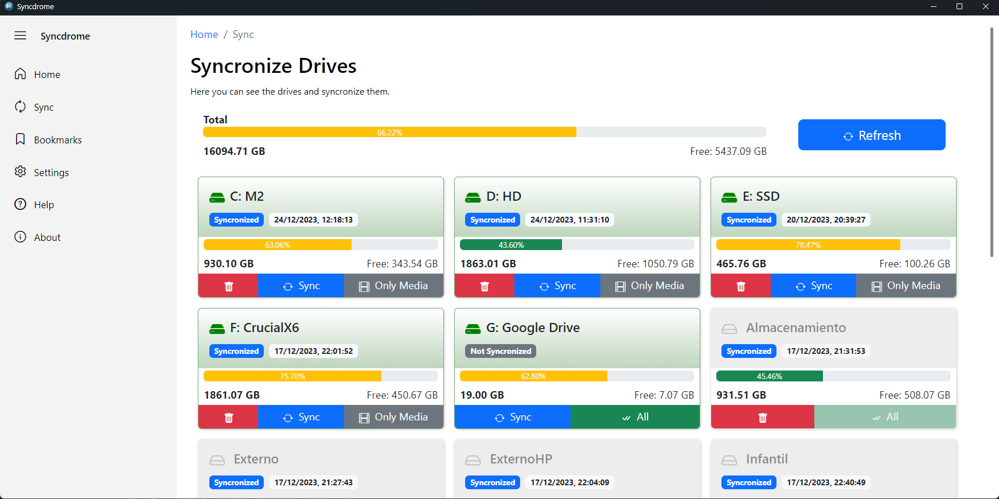

Syncdrome - Content Drives Finder App
=====================================


Syncdrome simplifies the organization and search of your digital files on specific hard drives.

About
-----

As someone who tends to accumulate digital files in a disorganized manner, I felt the need to develop a tool that would simplify my digital life. Syncdrome was born out of my own experience as a self-proclaimed "digital Diogenes."

Syncdrome is a Tauri application with React in the frontend and Node.js in the backend. This intuitive tool streamlines the search and organization of your files on specific hard drives. With a simple yet powerful interface, Syncdrome allows quick keyword searches and presents results organized by folders.

Installation
------------

1. Make sure you have [Node.js](https://nodejs.org/) installed on your machine.

2. Clone this repository:

    `git clone https://github.com/alexwing/Syncdrome`

3. Navigate to the project directory:

    `cd Syncdrome`

4. Install the dependencies:

    `npm install`

## Dependency Installation with Cargo

To compile and run the application, make sure you have Rust and Cargo installed:

1. Install Rust (which includes Cargo) from [https://www.rust-lang.org/tools/install](https://www.rust-lang.org/tools/install)
2. In the root of the project, run:

   ```bash
   cargo build
   ```

3. Optionally, you can also compile and package the Tauri application with:

   ```bash
   cargo tauri build
   ```

Configuration
-------------

In the `Settings` section of the application menu, you can configure the working folder where the file catalog will be stored. It's an interesting idea to store the catalog in a cloud storage service, such as Dropbox or Google Drive, for easy access from any device.

The `config.json` file is now defined in `config.rs` and is installed in the `.\syncdrome` folder within your home directory.

```json
{
  "folder": "C:\\myfolder",
  "extensions": {
    "document": {
      "icon": "File",
      "color": "black",
      "extensions": ["doc", "docx", "xls", "xlsx", "ppt", "pptx", "txt", "odt", "ods", "odp"]
    },
    ...
  }
}
```

Synchronization
---------------

To start using the search, you first need to create a catalog. Access the `Sync` option in the application menu.



A list of connected hard drives is displayed. Select the drive you want to synchronize and click the `Sync` button. The synchronized catalogs of disk volumes that are not currently connected to the computer are also shown. To remove them from the catalog, click the trash icon.

### Search

To search for a file, simply enter a keyword in the search field and press `Enter` or click the `Search` button. The search results are displayed in a dropdown list, showing disk volumes first, followed by folders and files that match the keyword.


Connected drives are shown with a green `ok` icon. For folders and files on connected drives, an `Open` button is displayed, allowing you to open the file with the system's default program or show the folder in the file explorer.

To the right of the files, an icon is displayed to add to favorites, which allows you to add the file to the favorites list, which is displayed in the `Bookmarks` section of the application menu. This favorite also allows a comment.

### Bookmarks

In the `Bookmarks` section of the application menu, a list of favorite files is displayed, allowing you to filter by file name and comment. You can also delete the favorite by clicking the trash can icon.

Favorites are stored in an SQLite database, in the application folder, in the `db.sqlite` file.

Code Details
------------

* The application uses the Tauri framework, which allows the use of Rust in the backend and React in the frontend.
* The code searches through all text files (`*.txt`) in the specified directory and groups the results by folder.
* Each result includes information such as line number, clean file name, type (file or folder), file name, and folder path.

About
-----

Syncdrome simplifies the organization and search of your digital files on specific hard drives. Developed by Alejandro Aranda, it is a Tauri application with React on the frontend and Node.js on the backend.

As someone who tends to accumulate digital files in a disorganized manner, I felt the need to develop a tool that would simplify my digital life. Syncdrome was born out of my own experience as a self-proclaimed "digital Diogenes."

This intuitive tool streamlines the search and organization of your files on specific hard drives. With a simple yet powerful interface, Syncdrome allows quick keyword searches and presents results organized by folders.

License
-------

This project is under the MIT License. See the LICENSE file for more details.

You can access the Syncdrome repository on [GitHub](https://github.com/alexwing/Syncdrome).

### Contribute and Support

If you find value in Syncdrome and want to contribute to its continuous development, consider making a donation on my [GitHub Sponsors](https://github.com/sponsors/alexwing) page. Your support is highly appreciated! 🚀✨

GitHub Sponsors is a new way to support open-source developers contributing to projects like Syncdrome. If Syncdrome is a useful tool for you, consider supporting my work with a donation. Your support allows me to dedicate more time to open-source projects like this one.

If you like Syncdrome, please consider leaving a review on [Product Hunt](https://www.producthunt.com/posts/syncdrome?utm_source=badge-featured&utm_medium=badge&utm_souce=badge-syncdrome). Your feedback is highly appreciated! 🚀✨

Copyleft © 2025 [Alejandro Aranda](https://aaranda.es/).

### Issues

Report any issues or suggestions related to this project on the [GitHub repository](https://github.com/alexwing/Syncdrome/issues).
