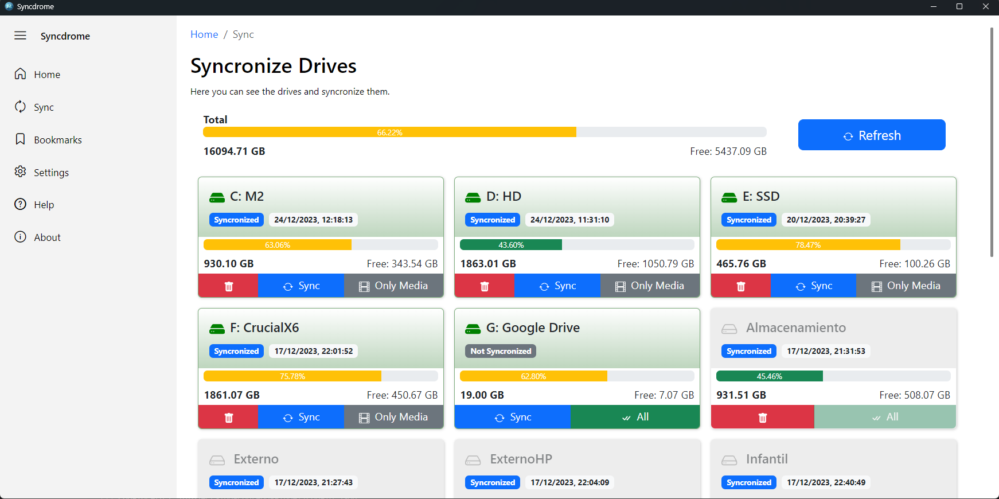
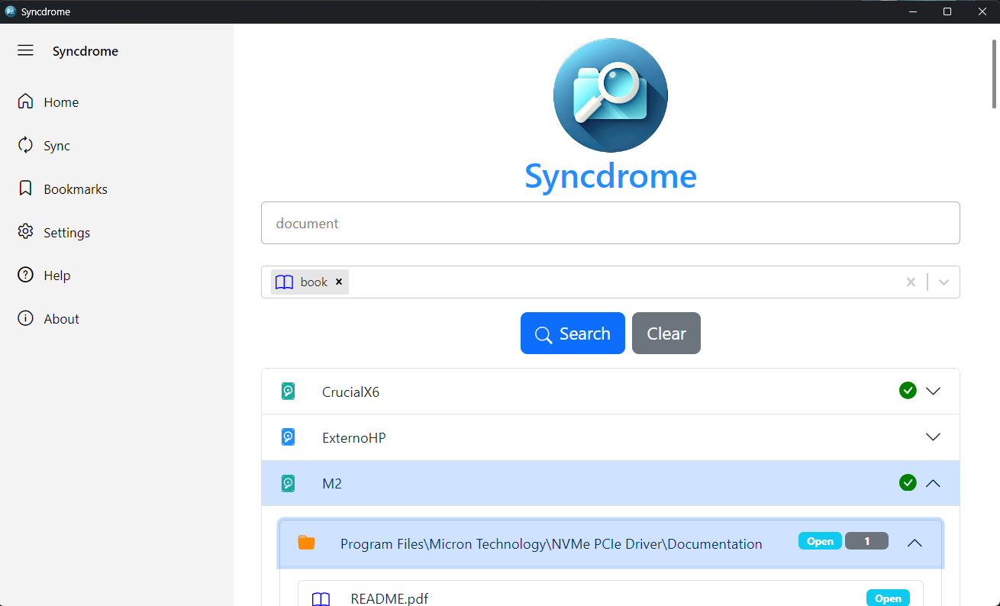

Syncdrome - Content Drives Finder App
=====================================


Syncdrome simplifies the organization and search of your digital files on specific hard drives.

About
-----

As someone who tends to accumulate digital files in a disorganized manner, I felt the need to develop a tool that would simplify my digital life. Syncdrome was born out of my own experience as a self-proclaimed "digital Diogenes."

Syncdrome is a Tauri application with React in the frontend and Rust in the backend. This intuitive tool streamlines the search and organization of your files on specific hard drives. With a simple yet powerful interface, Syncdrome allows quick keyword searches and presents results organized by folders.

Features
--------

* **Catalog your drives**: index every file of a drive into a plain-text catalog you can search even when the drive is unplugged (optionally media files only).
* **Search**: keyword search across all catalogs, with results grouped by volume and folder, file-type filters, previews and a right-click context menu.
* **Explorer**: browse synchronized volumes like a file manager — connected drives as quick-access cards, live size/date metadata, per-folder item counts, quick filtering, and a preview panel for images, Markdown, text/code, PDF, video and audio.
* **Bookmarks**: favorite files with comments, stored in SQLite, with search, previews and full context-menu actions.
* **File Name Cleaner**: batch renaming with a cut pattern and substitution rules, live red/green diff of every name, per-rule match counters and conflict detection.
* **Folder Sync**: mirror a source folder into a destination with an operation log.

Download
--------

You can download the latest version of Syncdrome for Windows from the [Releases](https://github.com/alexwing/Syncdrome/releases) section of the GitHub repository: an `.msi` installer (recommended) or a standalone `.zip` that runs without installation.

Code installation
-----------------

1. Make sure you have [Node.js](https://nodejs.org/) installed on your machine.

2. Clone this repository:

    `git clone https://github.com/alexwing/Syncdrome`

3. Navigate to the project directory:

    `cd Syncdrome`

4. Install the dependencies:

    `npm install`

## Dependency Installation with Cargo

To compile and run the application, make sure you have Rust and Cargo installed:

1. Install Rust (which includes Cargo) from [https://www.rust-lang.org/tools/install](https://www.rust-lang.org/tools/install)
2. In the src-tauri of the project, run:

   ```bash
   cargo build
   ```

3. Optionally, you can also compile and package the Tauri application with:

   ```bash
   cargo tauri build
   ```

Configuration
-------------

In the `Settings` section of the application menu, you can configure the working folder where the file catalog will be stored. It's an interesting idea to store the catalog in a cloud storage service, such as Dropbox or Google Drive, for easy access from any device.

The `config.json` file is now defined in `config.rs` and is installed in the `.\syncdrome` folder within your home directory.

```json
{
  "folder": "C:\\myfolder",
  "extensions": {
    "document": {
      "icon": "File",
      "color": "black",
      "extensions": ["doc", "docx", "xls", "xlsx", "ppt", "pptx", "txt", "odt", "ods", "odp"]
    },
    ...
  }
}
```

Synchronization
---------------

To start using the search, you first need to create a catalog. Access the `Sync` option in the application menu.



A list of connected hard drives is displayed. Select the drive you want to synchronize and click the `Sync` button. The synchronized catalogs of disk volumes that are not currently connected to the computer are also shown. To remove them from the catalog, click the trash icon.

### Search

To search for a file, simply enter a keyword in the search field and press `Enter` or click the `Search` button. The search results are displayed in a dropdown list, showing disk volumes first, followed by folders and files that match the keyword.



Connected volumes are listed first (ordered by drive letter). Click a result to open its preview panel, double-click to open the file with the system's default program, or right-click for the context menu (preview, open, show in folder, bookmark, copy name/path).

### Explorer

In the `Explorer` section you can browse the synchronized volumes like a file manager. Connected drives appear as quick-access cards; disconnected volumes can still be browsed from their catalog. The list shows type, size and modified date (live data on connected drives) plus per-folder item counts, with a quick filter by name or extension. Selecting a file opens the preview panel, which renders images, Markdown, text/code, PDF, video and audio, along with metadata, the file's bookmark and open/show-in-folder actions.

### Bookmarks

In the `Bookmarks` section, favorite files are grouped by volume with their comments. You can search by name or description, add bookmarks via a file dialog or drag-and-drop, and preview, open, edit, delete or copy from each row or its context menu.

Favorites are stored in an SQLite database, in the working folder, in the `db.sqlite` file.

### File Name Cleaner

The `File Name Cleaner` batch-renames the files of a folder using a recipe: a cut pattern (regex, or literal text if it does not compile) that removes everything from its first match to the end, plus ordered find→replace substitution rules with per-rule colors and live match counters. Every file shows a real diff (deletions struck in red, additions in green) computed live, conflicting names are excluded automatically, and any new name can still be edited manually. Extensions are never touched; duplicate spaces collapse and dangling separators are trimmed.

### Folder Sync

`Folder Sync` mirrors a source folder into a destination folder: matching files are kept, missing ones are added, and files not present in the source are removed, with a live log of every operation.

Code Details
------------

* The application uses the Tauri framework, which allows the use of Rust in the backend and React in the frontend.
* The code searches through all text files (`*.txt`) in the specified directory and groups the results by folder.
* Each result includes information such as line number, clean file name, type (file or folder), file name, and folder path.

About
-----

Syncdrome simplifies the organization and search of your digital files on specific hard drives. Developed by Alejandro Aranda, it is a Tauri application with React on the frontend and Node.js on the backend.

As someone who tends to accumulate digital files in a disorganized manner, I felt the need to develop a tool that would simplify my digital life. Syncdrome was born out of my own experience as a self-proclaimed "digital Diogenes."

This intuitive tool streamlines the search and organization of your files on specific hard drives. With a simple yet powerful interface, Syncdrome allows quick keyword searches and presents results organized by folders.

Version bump

For version bumping, you can use the following npm scripts:

```bash
npm run version:bump            # patch:  2.0.2 -> 2.0.3
npm run version:bump -- minor   # minor:  2.0.2 -> 2.1.0
npm run version:bump -- major   # major:  2.0.2 -> 3.0.0
npm run version:bump -- 4.1.0   # especific: 2.0.2 -> 4.1.0
```

License
-------

This project is under the MIT License. See the LICENSE file for more details.

You can access the Syncdrome repository on [GitHub](https://github.com/alexwing/Syncdrome).

### Contribute and Support

If you find value in Syncdrome and want to contribute to its continuous development, consider making a donation on my [GitHub Sponsors](https://github.com/sponsors/alexwing) page. Your support is highly appreciated! 🚀✨

GitHub Sponsors is a new way to support open-source developers contributing to projects like Syncdrome. If Syncdrome is a useful tool for you, consider supporting my work with a donation. Your support allows me to dedicate more time to open-source projects like this one.

If you like Syncdrome, please consider leaving a review on [Product Hunt](https://www.producthunt.com/posts/syncdrome?utm_source=badge-featured&utm_medium=badge&utm_souce=badge-syncdrome). Your feedback is highly appreciated! 🚀✨

Copyleft © 2025 [Alejandro Aranda](https://aaranda.es/).

### Issues

Report any issues or suggestions related to this project on the [GitHub repository](https://github.com/alexwing/Syncdrome/issues).
