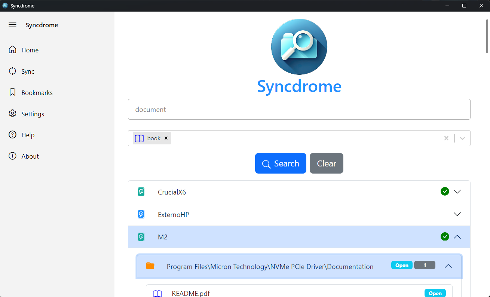

Syncdrome - Content Drives Finder App
=====================================


Syncdrome simplifies the organization and search of your digital files on specific hard drives.

About
-----

As someone who tends to accumulate digital files in a disorganized manner, I felt the need to develop a tool that would simplify my digital life. Syncdrome was born out of my own experience as a self-proclaimed "digital Diogenes."

Syncdrome is an Electron application with React in the frontend and Node.js in the backend. This intuitive tool streamlines the search and organization of your files on specific hard drives. With a simple yet powerful interface, Syncdrome allows quick keyword searches and presents results organized by folders.

Installation
------------

1.  Make sure you have [Node.js](https://nodejs.org/) installed on your machine.
    
2.  Clone this repository:
    
    `git clone https://github.com/alexwing/Syncdrome`
    
3.  Navigate to the project directory:
    
    `cd Syncdrome`
    
4.  Install the dependencies:
    
    
    `npm install`

Configuration
-------------

In the `Settings` section of the application menu, you can configure the working folder where the file catalog will be stored. It's an interesting idea to store the catalog in a cloud storage service, such as Dropbox or Google Drive, for easy access from any device.

The working folder is stored within the application folder in the `resources\config.json` file. You can also configure file extensions to change the color of file icons or add new file extensions.

```json
{
  "folder": "C:\\myfolder",
  "extensions": {
    "document": {
      "icon": "File",
      "color": "black",
      "extensions": ["doc", "docx", "xls", "xlsx", "ppt", "pptx", "txt", "odt", "ods", "odp"]
    },
    ...
  }
}
```

Synchronization
---------------

To start using the search, you first need to create a catalog. Access the `Sync` option in the application menu.


A list of connected hard drives is displayed. Select the drive you want to synchronize and click the `Sync` button. The synchronized catalogs of disk volumes that are not currently connected to the computer are also shown. To remove them from the catalog, click the trash icon.

### Search

To search for a file, simply enter a keyword in the search field and press `Enter` or click the `Search` button. The search results are displayed in a dropdown list, showing disk volumes first, followed by folders and files that match the keyword.



Connected drives are shown with a green `ok` icon. For folders and files on connected drives, an `Open` button is displayed, allowing you to open the file with the system's default program or show the folder in the file explorer.

To the right of the files, an icon is displayed to add to favorites, which allows you to add the file to the favorites list, which is displayed in the `Bookmarks` section of the application menu. This favorite also allows a comment.

### Bookmarks

In the `Bookmarks` section of the application menu, a list of favorite files is displayed, allowing you to filter by file name and comment. You can also delete the favorite by clicking the trash can icon.

Favorites are stored in an SQLite database, in the application folder, in the `db.sqlite` file.

Batch File Version
------------------

The `ContentDrive.bat` batch file is used to generate text files with the content of the hard drives. The batch file description is as follows:

Copy file to hard drive and run it. The file will create a text file with the list of all files on the drive. The text file will be saved in the Google drive/ Dropbox (or other folder). The file name will be the drive name with the extension `.txt`. For example, if the drive name is `My Passport`, the file name will be `My Passport.txt`.

In current version, not is necessary to copy the file to the hard drive, you can run syncronization from the application.


```bat
@rem  Batch file to create a list of all files on a drive. 
@rem  The list is saved in the Google drive folder.

@ set drive="C:\Users\Windows\Mi unidad\Software\DiscosDuros\"

@echo off

for /f "tokens=1-5*" %%1 in ('vol') do (
   set vol=%%6 & goto done
)
:done
set vol=%vol:~0,-1%
dir . /s /b > %drive%%vol:~5%".txt" 

@echo on
@echo List of files on %vol% saved in %drive%%vol:~5%".txt"
@pause

```

Code Details
------------

*   The application uses Express.js for route handling and server creation.
*   The code searches through all text files (`*.txt`) in the specified directory and groups the results by folder.
*   Each result includes information such as line number, clean file name, type (file or folder), file name, and folder path.


Todo
----

*   Add a drag and drop feature to the bookmark list, add a comment to the file, and save the comment in the database.
*   Sincronize a folder specified by the user, not a drive.
*   Add file explorer option, to browse the files in all drives connected to the computer.
*   Add a real search option to search for a file in all drives connected to the computer.
*   Rename utility to rename files and folders.


About
-----

Syncdrome simplifies the organization and search of your digital files on specific hard drives. Developed by Alejandro Aranda, it is an Electron application with React on the frontend and Node.js on the backend.

As someone who tends to accumulate digital files in a disorganized manner, I felt the need to develop a tool that would simplify my digital life. Syncdrome was born out of my own experience as a self-proclaimed "digital Diogenes."

This intuitive tool streamlines the search and organization of your files on specific hard drives. With a simple yet powerful interface, Syncdrome allows quick keyword searches and presents results organized by folders.


# Chat-With-RTX-typeScript-api

This project has a test of a chat with "Chat to RTX" API, you can try this in development mode, you need to have the ChatRTX server running in your local machine.

In the menu of the application you can find the option "Chat" to test the chat with the RTX server.

## What is ChatRTX?

ChatRTX is a demonstration application that allows you to customize a large language model (LLM) GPT connected to your own content: documents, notes, videos, or other data. By leveraging retrieval-augmented generation (RAG), TensorRT-LLM, and RTX acceleration, you can query a customized chatbot for contextually relevant answers quickly. Since everything runs locally on your RTX Windows PC or workstation, you'll get fast, secure results.

You can find more information about ChatRTX in the following link: [ChatRTX](https://www.nvidia.com/en-us/ai-on-rtx/chatrtx/)

## API Documentation

**File**: chatApi.ts

**Description**: This class is used to send a message to the RTX chat server and get the response.

**Usage**:
```javascript
    const port = 5000;
    const queueManager = new chatApi(port);
    queueManager
        .sendMessage(message)
        .then((response) => {
            console.log("Server response: ", response);
        })
        .catch((error) => {
            console.error("Error:", error);
        });
```

This code is a TypeScript version of the original Python code at the following link: [Chat-With-RTX-python-api](https://github.com/rpehkone/Chat-With-RTX-python-api)


License
-------

This project is under the MIT License. See the [LICENSE](LICENSE) file for more details.

You can access the Syncdrome repository on [GitHub](https://github.com/alexwing/Syncdrome).

### Contribute and Support

If you find value in Syncdrome and want to contribute to its continuous development, consider making a donation on my [GitHub Sponsors](https://github.com/sponsors/alexwing) page. Your support is highly appreciated! 🚀✨

GitHub Sponsors is a new way to support open-source developers contributing to projects like Syncdrome. If Syncdrome is a useful tool for you, consider supporting my work with a donation. Your support allows me to dedicate more time to open-source projects like this one.

If you like Syncdrome, please consider leaving a review on [Product Hunt](https://www.producthunt.com/posts/syncdrome?utm_source=badge-featured&utm_medium=badge&utm_souce=badge-syncdrome). Your feedback is highly appreciated! 🚀✨

Copyleft © 2024 [Alejandro Aranda](https://aaranda.es/).

### Issues

Report any issues or suggestions related to this project on the [GitHub repository](https://github.com/alexwing/Syncdrome/issues).